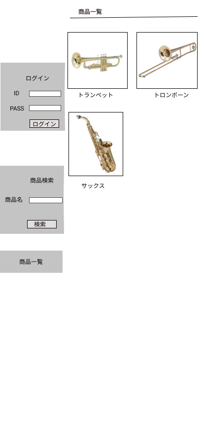

### 画面詳細図
## トップページ
### プロトタイプは以下のリンク先
[プロトタイプ](https://www.figma.com/file/2G5Z0bVzOBsh0fxuAMleI2/Untitled?node-id=0%3A1)
*****

*****
補足:対応DBの列はDB設計後、〇を対応するテーブル・カラム名に差し替えること。

| ID | 要素 | 内容 | アクション | イベント | 対応DB |
|----|------|------|-----------|-----------|--------|
|1   |バナー|サイト名表示|-    |-          |-        |
|2   |ログイン|テキスト画像|-   |-         |-        |
|3   |ID    |入力欄 |テキスト入力|-        |-        |
|4   |PASS  |入力欄 |テキスト入力|-        |-        |
|5   |商品検索|テキスト画像|-    |-        |-        |
|6   |商品名|入力欄 |テキスト入力|検索結果表示|-      |
|7   |商品画像|画像リンク|クリック|詳細画面表示|-     |
