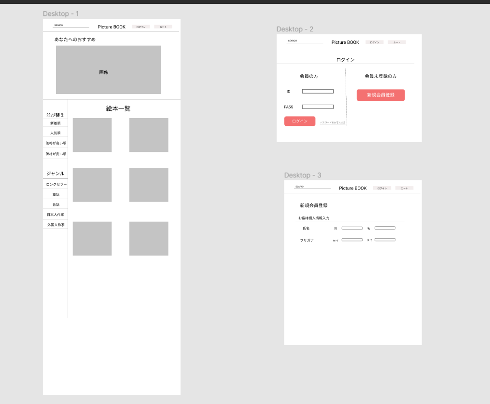

### 画面詳細図
## トップページ
### プロトタイプは以下のリンク先
[プロトタイプ](https://www.figma.com/file/DYPRUY5ThM6KcMcjHO6g18/Untitled?node-id=0%3A1)
*****

*****
補足:対応DBの列はDB設計後、〇を対応するテーブル・カラム名に差し替えること。

| ID | 要素 | 内容 | アクション | イベント | 対応DB |
|----|------|------|-----------|-----------|--------|
|1   |バナー|サイト名表示|-     |-         |-       |
|2   |ページ名|テキスト画像|クリック|トップページ表示|-|
|3   |検索  |入力欄|テキスト入力|検索結果表示|-      |
|4   |カート|テキスト画像|クリック|カート内表示|-    |
|5   |並び替え|テキスト|-       |-         |-       |
|6   |新着順|テキストリンク|クリック|並び替え|-      |
|7   |人気順|テキストリンク|クリック|並び替え|-      |
|8   |価格が高い順|テキストリンク|クリック|並び替え|-|
|9   |価格が安い順|テキストリンク|クリック|並び替え|-|
|10  |ジャンル|テキスト|-       |-         |-      |
|11   |ロングセラー|テキストリンク|クリック|商品表示|-|
|12   |童話 |テキストリンク|クリック|商品表示|-     |
|13   |昔話 |テキストリンク|クリック|商品表示|-     |
|14   |日本人作家|テキストリンク|クリック|商品表示|-|
|15   |外国人作家|テキストリンク|クリック|商品表示|-|
|16   |商品画像|画像リンク|クリック|商品詳細表示|-  |
